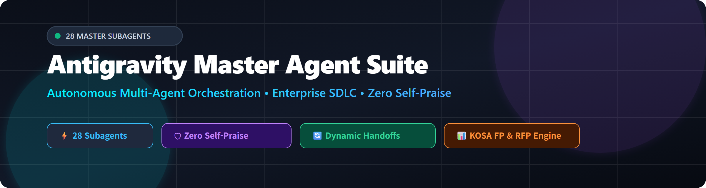
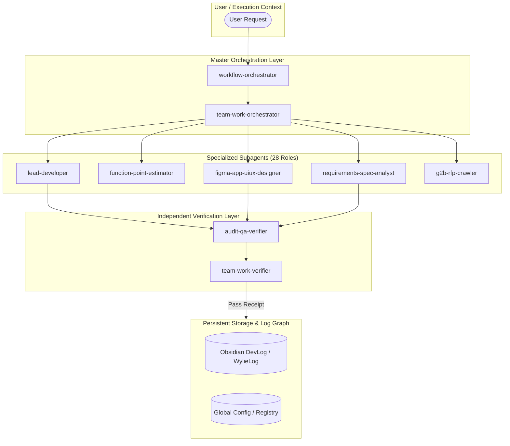

<p align="center">
  
</p>

<p align="center">
  <a href="https://github.com/shinjaehyun20/antigravity-agent-suite"></a>
  <a href="file:///D:/workspace/runtime/registry/antigravity-agents/"></a>
  <a href="https://github.com/shinjaehyun20/antigravity-agent-suite"></a>
  <a href="#-license"></a>
</p>

<h3 align="center">
  ⚡ Autonomous Multi-Agent Suite for Enterprise SDLC, Design, Procurement, &amp; Verification
</h3>

<p align="center">
  <b>Antigravity Master Agent Suite</b> is a production-grade multi-agent execution framework containing <b>28 specialized subagents</b>. Built on zero emotional self-praise, strict 3rd-party verification, structured inter-agent handoff envelopes, and non-negotiable write boundaries.
</p>

<p align="center">
  <a href="#-master-agent-suite-28-subagents">Agent Matrix</a> •
  <a href="#-system-architecture--handoff-flow">Architecture</a> •
  <a href="#-directory-structure">Structure</a> •
  <a href="#-execution-discipline--guardrails">Guardrails</a> •
  <a href="#-quick-start">Quick Start</a>
</p>

---

## 📌 Executive Summary

Modern enterprise software projects require distinct expertise across architecture, UI/UX publishing, RFP crawling, Function Point (FP) cost estimation, 3D/video rendering, and independent verification. 

This repository serves as the **canonical persistent registry for 28 specialized Antigravity subagents**, operating under a unified lifecycle: **`goal → worktree → evidence → acceptance gate`**.

---

## 🛠 Master Agent Suite (28 Subagents)

<details open>
<summary><b>1. Orchestration &amp; Governance Cluster (3 Agents)</b></summary>
<br>

| Agent Name | Primary Role | Specification File | Capabilities |
| :--- | :--- | :--- | :--- |
| **`workflow-orchestrator`** | SDLC PM &amp; Router | [`subagents/workflow-orchestrator.json`](subagents/workflow-orchestrator.json) | Decomposes high-level goals into execution phases; manages task.md and output contract tables |
| **`team-work-orchestrator`** | Multi-Runtime Controller | [`subagents/team-work-orchestrator.json`](subagents/team-work-orchestrator.json) | Manages role switching (orchestrator ↔ worker ↔ verifier) and WorkItem handoffs across runtimes |
| **`team-work-verifier`** | Acceptance Gate Verifier | [`subagents/team-work-verifier.json`](subagents/team-work-verifier.json) | Validates WorkItem evidence parity, scope boundaries, and redaction rules |

</details>

<details>
<summary><b>2. Architecture, Development &amp; Verification Cluster (4 Agents)</b></summary>
<br>

| Agent Name | Primary Role | Specification File | Capabilities |
| :--- | :--- | :--- | :--- |
| **`system-architect`** | System &amp; ADR Architect | [`subagents/system-architect.json`](subagents/system-architect.json) | Models domain architecture, API contracts, DB schemas, and ADR documents |
| **`lead-developer`** | Lead Software Engineer | [`subagents/lead-developer.json`](subagents/lead-developer.json) | Implements features, refactors code, executes build/test suites with copy-edit safety |
| **`audit-qa-verifier`** | Independent QA Auditor | [`subagents/audit-qa-verifier.json`](subagents/audit-qa-verifier.json) | Performs 3rd-party verification, OOXML scans, PNG render diffs, and SHA256 checks |
| **`database-graph-architect`** | DB &amp; GraphRAG Specialist | [`subagents/database-graph-architect.json`](subagents/database-graph-architect.json) | Designs SQLite/FTS5 indexes, GraphRAG knowledge graphs, and Portfolio DB (`CONTRACT.md`) |

</details>

<details>
<summary><b>3. Specialized Design, Publishing &amp; Art Direction Cluster (4 Agents)</b></summary>
<br>

| Agent Name | Primary Role | Specification File | Capabilities |
| :--- | :--- | :--- | :--- |
| **`creative-visual-art-director`** | Creative Art Director | [`subagents/creative-visual-art-director.json`](subagents/creative-visual-art-director.json) | Conceives visual key arts, brand themes, mood boards, and generative AI art direction |
| **`figma-app-uiux-designer`** | Figma &amp; App Specialist | [`subagents/figma-app-uiux-designer.json`](subagents/figma-app-uiux-designer.json) | Designs Figma component tokens, mobile app UI/UX, bottomsheets, and touch interaction specs |
| **`web-publishing-specialist`** | Web Publishing Layout | [`subagents/web-publishing-specialist.json`](subagents/web-publishing-specialist.json) | Authors clean HTML5/CSS3, responsive grid layouts, W3C accessibility, and micro-animations |
| **`design-system-formatter`** | Template Format Keeper | [`subagents/design-system-formatter.json`](subagents/design-system-formatter.json) | Enforces **Keep Source Formatting** rules, slide type re-mapping, and OOXML layout integrity |

</details>

<details>
<summary><b>4. Requirements, Cost Estimation &amp; Procurement Cluster (3 Agents)</b></summary>
<br>

| Agent Name | Primary Role | Specification File | Capabilities |
| :--- | :--- | :--- | :--- |
| **`requirements-spec-analyst`** | SRS &amp; Requirements Analyst | [`subagents/requirements-spec-analyst.json`](subagents/requirements-spec-analyst.json) | Authors Software Requirements Specifications (SRS), classifies FR/NFR, and establishes RTM |
| **`function-point-estimator`** | KOSA FP Cost Estimator | [`subagents/function-point-estimator.json`](subagents/function-point-estimator.json) | Calculates unadjusted/adjusted Function Points (FP) and M/M cost estimation via KOSA guide |
| **`g2b-rfp-crawler`** | G2B Procurement Crawler | [`subagents/g2b-rfp-crawler.json`](subagents/g2b-rfp-crawler.json) | Crawls Korea G2B (나라장터) procurement feeds, fetches RFP attachments, and tracks bidding matrices |

</details>

<details>
<summary><b>5. 3D Graphics, Video Synthesis &amp; Game Engine Cluster (2 Agents)</b></summary>
<br>

| Agent Name | Primary Role | Specification File | Capabilities |
| :--- | :--- | :--- | :--- |
| **`video-media-synthesis-specialist`** | AI Video &amp; Motion Specialist | [`subagents/video-media-synthesis-specialist.json`](subagents/video-media-synthesis-specialist.json) | Generates AI video clips (Sora/Runway/AnimateDiff) and executes FFmpeg video rendering |
| **`game-3d-unreal-blender-engine-developer`** | 3D Engine &amp; Game Developer | [`subagents/game-3d-unreal-blender-engine-developer.json`](subagents/game-3d-unreal-blender-engine-developer.json) | Automates Blender Python (`bpy`), Unreal Engine C++/Blueprints, and 3D game logic |

</details>

<details>
<summary><b>6. Research, Mail, Archiving &amp; Operations Cluster (8 Agents)</b></summary>
<br>

| Agent Name | Primary Role | Specification File | Capabilities |
| :--- | :--- | :--- | :--- |
| **`proposal-rfp-specialist`** | Proposal &amp; RFP Specialist | [`subagents/proposal-rfp-specialist.json`](subagents/proposal-rfp-specialist.json) | Structures proposal outlines, chapter drafts, and compliance response matrices |
| **`gmail-inbox-classifier`** | Mail Classifier &amp; Intake | [`subagents/gmail-inbox-classifier.json`](subagents/gmail-inbox-classifier.json) | Parses Gmail/Outlook inboxes, classifies project domains, and verifies attachment intake |
| **`academic-research-benchmarker`** | Literature &amp; Technical Spike | [`subagents/academic-research-benchmarker.json`](subagents/academic-research-benchmarker.json) | Searches arXiv/OpenAlex papers, conducts continuous benchmarking, and designs Mermaid diagrams |
| **`runtime-self-improver`** | Self-Improvement Engine | [`subagents/runtime-self-improver.json`](subagents/runtime-self-improver.json) | Monitors execution traces and writes self-improvement proposals (`proposal-only` rule) |
| **`skill-foundry-weaver`** | Skill &amp; Helper Script Weaver | [`subagents/skill-foundry-weaver.json`](subagents/skill-foundry-weaver.json) | Curates and defines custom skills under `C:\Users\jaehy\.gemini\config\skills\` |
| **`mcp-skill-curator`** | MCP Server &amp; Skill Manager | [`subagents/mcp-skill-curator.json`](subagents/mcp-skill-curator.json) | Manages and audits 7 MCP server connections and lazily-loaded tool schemas |
| **`technical-writer`** | Walkthrough &amp; API Docs | [`subagents/technical-writer.json`](subagents/technical-writer.json) | Generates walkthrough markdown documents, API references, and devlogs |
| **`session-archivist`** | Log Graph &amp; History Keeper | [`subagents/session-archivist.json`](subagents/session-archivist.json) | Summarizes session facts, updates Obsidian devlog/wylieLog graphs, and appends to MRKB |
| **`hf-audit-spec-verifier`** | HF Audit &amp; Screen Verifier | [`subagents/hf-audit-spec-verifier.json`](subagents/hf-audit-spec-verifier.json) | Verifies HF/KHPT screen specification tables, RTM matrices, and audit response documents |
| **`wylie-weekly-report-injector`** | Groupware Report Injector | [`subagents/wylie-weekly-report-injector.json`](subagents/wylie-weekly-report-injector.json) | Compiles weekly reports, attaches Chrome 9333 tab, and enforces `.popOverlay` modal safety |
| **`ttd-notion-comfyui-publisher`** | Multi-Engine Image Publisher | [`subagents/ttd-notion-comfyui-publisher.json`](subagents/ttd-notion-comfyui-publisher.json) | Generates TTD 7-slot images (Gemini generate_image / Nano / ComfyUI) and publishes to Notion |
| **`office-com-datapack-specialist`** | Office COM &amp; DataPack | [`subagents/office-com-datapack-specialist.json`](subagents/office-com-datapack-specialist.json) | Handles win32com PID kill hygiene, openpyxl row_dimensions clear, and HWPX XML ParaShape |

</details>

---

## 🏗 System Architecture &amp; Handoff Flow



---

## 📂 Directory Structure

```text
antigravity-agent-suite/
├── subagents/                           # 28 Specialized Agent Definition JSON Specs
│   ├── academic-research-benchmarker.json
│   ├── audit-qa-verifier.json
│   ├── creative-visual-art-director.json
│   ├── database-graph-architect.json
│   ├── design-system-formatter.json
│   ├── figma-app-uiux-designer.json
│   ├── function-point-estimator.json
│   ├── g2b-rfp-crawler.json
│   ├── game-3d-unreal-blender-engine-developer.json
│   ├── gmail-inbox-classifier.json
│   ├── hf-audit-spec-verifier.json
│   ├── lead-developer.json
│   ├── mcp-skill-curator.json
│   ├── office-com-datapack-specialist.json
│   ├── proposal-rfp-specialist.json
│   ├── requirements-spec-analyst.json
│   ├── runtime-self-improver.json
│   ├── session-archivist.json
│   ├── skill-foundry-weaver.json
│   ├── system-architect.json
│   ├── team-work-orchestrator.json
│   ├── team-work-verifier.json
│   ├── technical-writer.json
│   ├── ttd-notion-comfyui-publisher.json
│   ├── uiux-publishing-designer.json
│   ├── video-media-synthesis-specialist.json
│   ├── web-publishing-specialist.json
│   ├── workflow-orchestrator.json
│   └── wylie-weekly-report-injector.json
├── docs/
│   ├── architecture/                    # Architecture diagrams & system overview
│   │   └── system-overview.md
│   ├── assets/                          # Hero banner PNG & visual diagrams
│   │   ├── antigravity-suite-hero-banner.png
│   │   └── antigravity-suite-hero-banner.svg
│   └── contracts/                       # Inter-agent handoff envelope specifications
│       └── subagent-handoff-spec-v1.md
├── AGENTS.md                            # Runtime governance & write boundary contract
├── README.md                            # Main project documentation & catalog matrix
└── STATUS.md                            # Verification receipt & milestone status
```

---

## 🛡 Execution Discipline &amp; Guardrails

1. **Zero Emotional Self-Praise**: Ban on conversational filler ("flawlessly", "perfect"). Progress is communicated strictly through quantitative metrics (file sizes, byte counts, command exit code `0`).
2. **Supplied Source Immutability**: Production reference templates and canonical spreadsheets are read-only. Edits occur on local staging copies (`D:\workspace\runtime\tmp\`) and undergo SHA256 integrity scans before replacement.
3. **3rd-Party Verification Requirement**: Self-declared completion is invalid. Tasks require independent verification by `audit-qa-verifier` or automated test scripts.
4. **Port &amp; Process Isolation**: Background listening sockets (Ports 9100-9199) and background COM/Excel instances must be forcibly terminated upon task closure.

---

## 🚀 Quick Start

### 1. Clone Repository
```bash
git clone https://github.com/shinjaehyun20/antigravity-agent-suite D:\workspace\projects\active\antigravity-agent-suite
```

### 2. Synchronize to Global Config
```powershell
Copy-Item "D:\workspace\projects\active\antigravity-agent-suite\subagents\*.json" -Destination "C:\Users\jaehy\.gemini\config\subagents\" -Force
```

### 3. Invoke Subagent in Antigravity Shell
```python
invoke_subagent(
    TypeName="function-point-estimator",
    Role="FP Cost Estimator",
    Prompt="Calculate unadjusted and adjusted Function Points (FP) for HF Screen Spec V1.21 according to KOSA guidelines."
)
```

---

## 📄 License

Proprietary © 2026 Shin Jaehyun (Wylie). All rights reserved.
