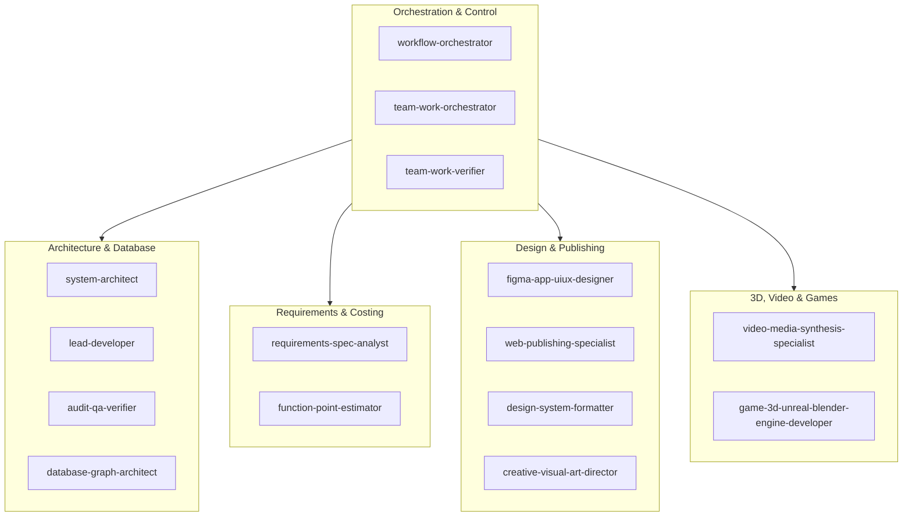

# Architecture Overview — Antigravity Master Agent Suite

## High-Level Architecture
The Antigravity Agent Suite organizes 28 specialized subagents into functional clusters. Each cluster handles a distinct domain of software engineering, design, cost estimation, or operations.

## Key Principles
1. **Decoupled Autonomy**: Each subagent runs in its own context window with specialized tools and non-negotiable system prompts.
2. **Deterministic Lifecycle**: Every task follows `goal → worktree → evidence → acceptance gate`.
3. **Auditability**: Execution traces and receipts are saved to `runtime/audit/YYYY-MM-DD/`.
